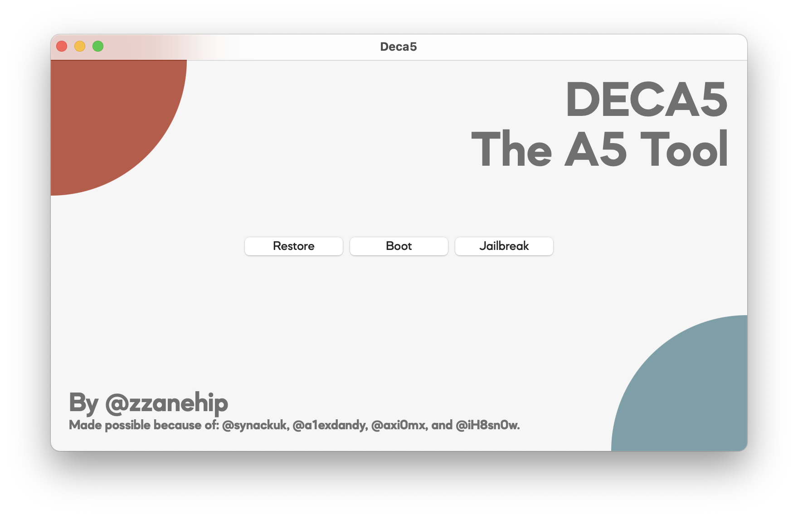
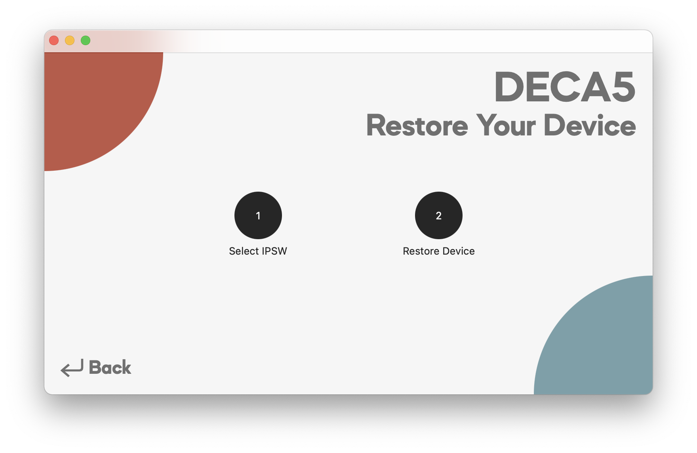
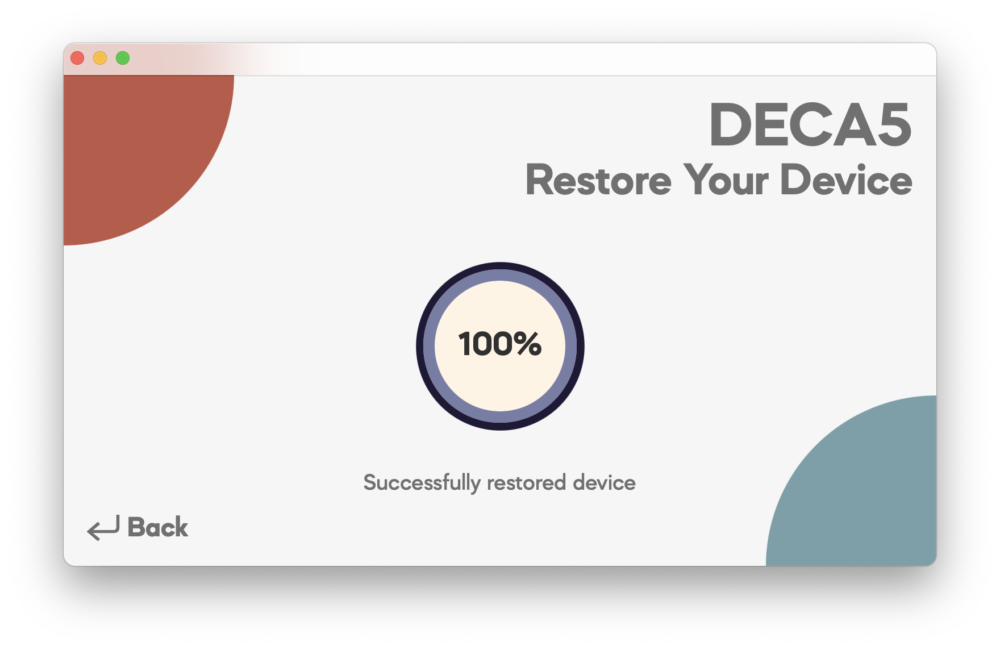
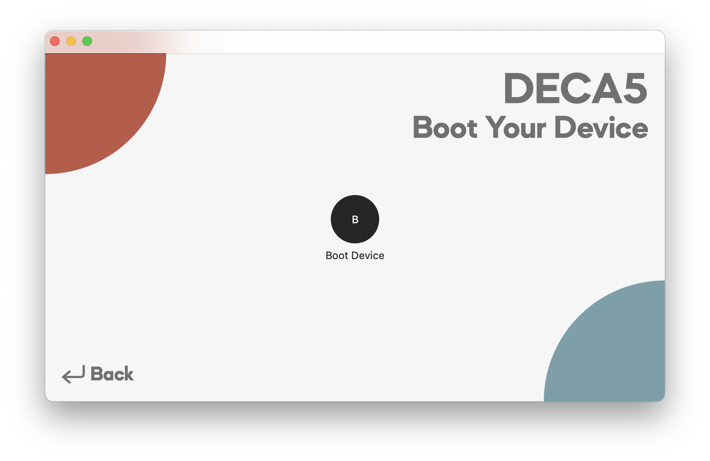
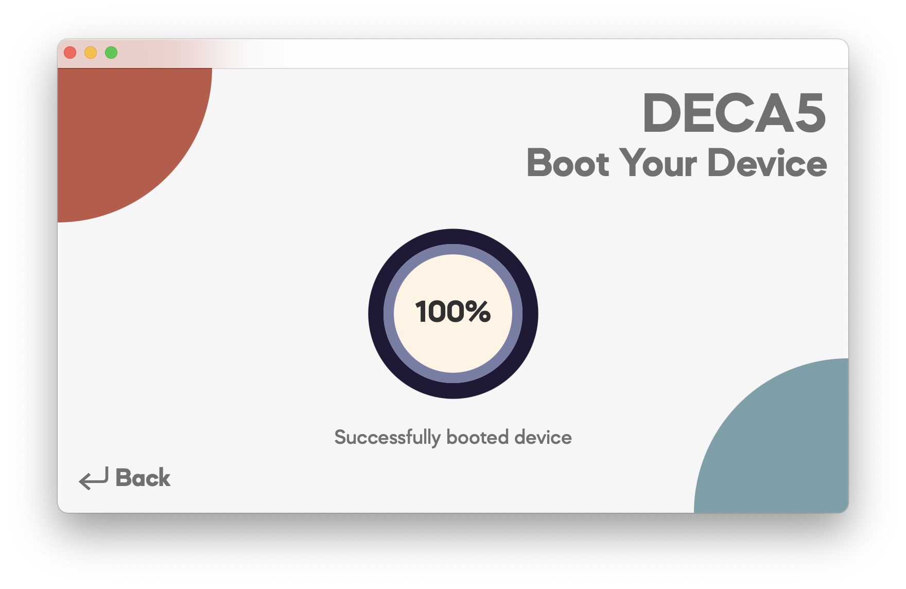

# Deca5 v1.1 ☕

Tethered Downgrade Your A5 Device Today. By @zzanehip.

## What is Deca5?
* Deca5 (pronounced "Decaf") is a GUI tool to downgrade your A5 device. It is built with three things in mind: user-experience, performance, and reliability 👍.
* Deca5 is unique, it is built entierly using Swift, SwiftUI, and C — it is built for modern versions of Mac OS. Moreover, much attention was given to the tool's design, look, and feel.
* And of course, Deca5 fully opensource 📂. Feel free to modify the tool to your liking. 
* Deca5 will run on any Mac running between El Capitan (**10.11**) and Big Sur (**11.0**) 🖥️. It supports all **A5** (and theoretically all A6) devices📱.
* Users running **Catalina** or **Big Sur** can download Deca5. Users running between **El Capitan** and **Mojave** can download Deca5 (older Macs build). 
* To use Deca5 you must enter pwndfu (not kDFU) - this is possible thanks to @a1exdandy, @nyansatan, and @synackuk https://github.com/synackuk/checkm8-a5
* *Note, as of v1.1, Jailbreaking and Switchboard functionality has been temporarily removed due to various bugs. I'll restore the functionality in the next few days when all are fixed.*
* ***The latest release of Deca5 can be downloaded from [here.](https://github.com/zzanehip/Deca5/releases/latest)***  

 
## Using Deca5

The homescreen of Deca5 looks like this. You have options to Restore and Boot. 
 
To restore, first press "Select IPSW" and select your IPSW. Once you see the message "Done. You can restore" you can plug in your PWNED device and press "Restore Device." You'll know if you restored successfully if you see the message "Successfully restored device."
Before Restoring            |  After Restoring
:-------------------------:|:-------------------------:
  |  

To boot, just plug in your PWNED device and press "Boot Device." You'll know if you booted successfully if you see the message "Successfully booted device."

Before Booting            |  After Booting
:-------------------------:|:-------------------------:
  |  

## Developer Information

	* libidevicerestore
		* A modifed version of idevicerestore capable of loading components from any location. Also modified to boot device, and includes fixes for use in Swift.
		* https://github.com/zzanehip/idevicerestore-swift
	* libxpwntool
		* A modified version of xpwntool for use in Swift.
		* https://github.com/zzanehip/xpwntool-swift
	* libiboot32patcher
		* A modified version of iBoot32Patcher for use in Swift.
		* https://github.com/zzanehip/iBoot32Patcher-Swift
	* libprerestore
		* A tool to faciliate all pre-restore and booting operations. 
		* https://github.com/zzanehip/deca5

## Version History
	* v1.1 - Adds "older Macs build" which adds support for 10.11 to 10.14. Various other bug fixes and compilation performance improvements, as well. 
	* v1.0 Beta - Launch

## And Of Course Thank You To
* @a1exdandy for A5 Checkm8.
* @nyansatan for A5 Checkm8.
* @synackuk for A5 Checkm8 and idevicerestore work. 
* @axi0mx for Checkm8.
* @libimobiledevice for idevicerestore. 
* @iH8Sn0w for iBoot32Patcher.
* @planetbeing for xpwn.
* @dora2ios for iBSS execution.
* @iOSReleases for firmware keys.
* @Ralph0045 for iOS 4 fix info. 
* @Exploit3dGuy for inspiration to make Deca5.
* @RealiMuseum for inspiration to make Deca5.
* @Tommymossss for entertaining me while I made this.
